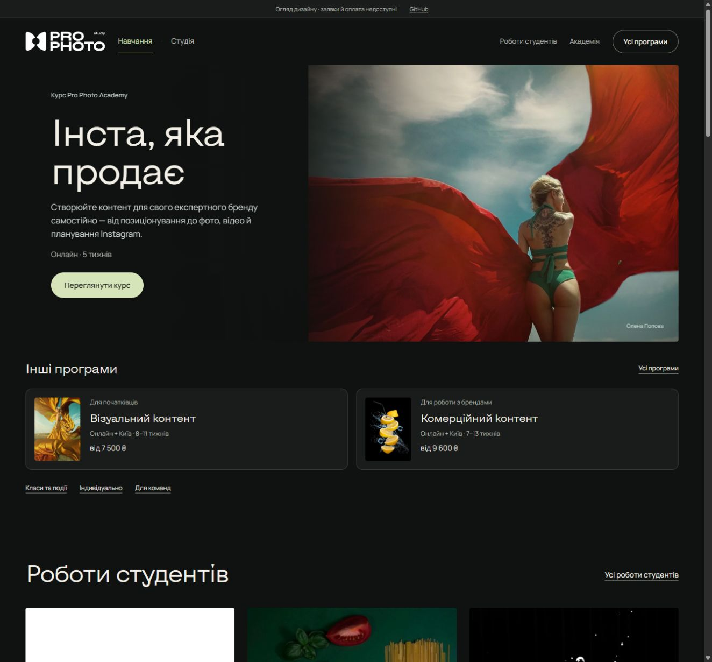

# Atomic refactor verification · 9 October 2026

- Main refactor commit: `3360849`; generated review branch: `9c58324`
- Architecture guard passed across 215 TypeScript modules: component ownership, colocated types/hooks, no upward UI dependencies, no server transports in UI and no runtime import cycles
- Strict TypeScript, including unused locals/parameters, passed; formatter check passed
- All 48 tests passed, including the existing payment, inquiry, ecosystem and operations regressions plus architecture and review-layout checks
- Production Next.js build passed with 32 generated routes; static review build passed with 27 validated HTML pages
- Sanity GROQ projection passed against migrated documents; fixture validation passed for 6 programs, 6 intakes, 19 photographs and legal/review content
- Compared headings, paragraphs, captions, links, image sources/alt text and form controls across all 27 review pages against the pre-refactor export: no differences after accounting for explicit button types
- Browser verified package comparison, Escape/focus restoration, inquiry dialog fields, gallery navigation, catalog filtering and the selected podcast booking URL
- At 390px, mobile navigation and comparison worked without horizontal overflow; pricing remained before the course photograph
- Static query adapters selected Content Day for `type=class` and the podcast room for `room=podcast`; inquiry submission remained disabled and privacy links retained the project prefix
- Booking navigation remained focused, with no visible competing ecosystem offer
- GitHub Pages deployment [37869707176](https://github.com/alexus2mad/Prophotoacademy/actions/runs/37869707176) completed successfully; the deployed refactored homepage was checked with no browser errors

The visual design, approved content and server-side purchase policies are preserved. The operations form now retains its form reference before awaiting the response, so successful access can clear the temporary access field correctly. The GitHub version remains a review with unavailable server actions.

